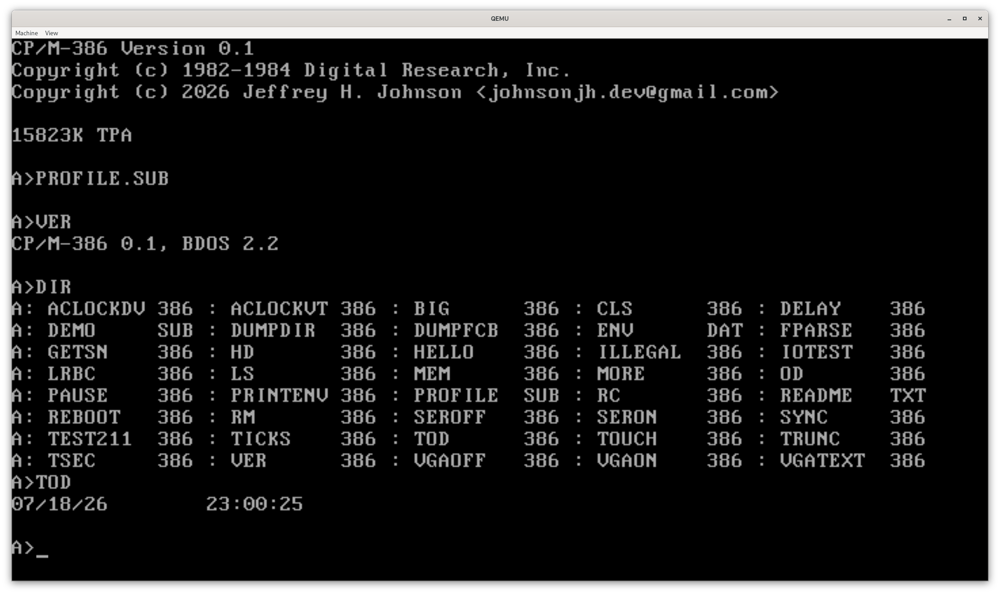
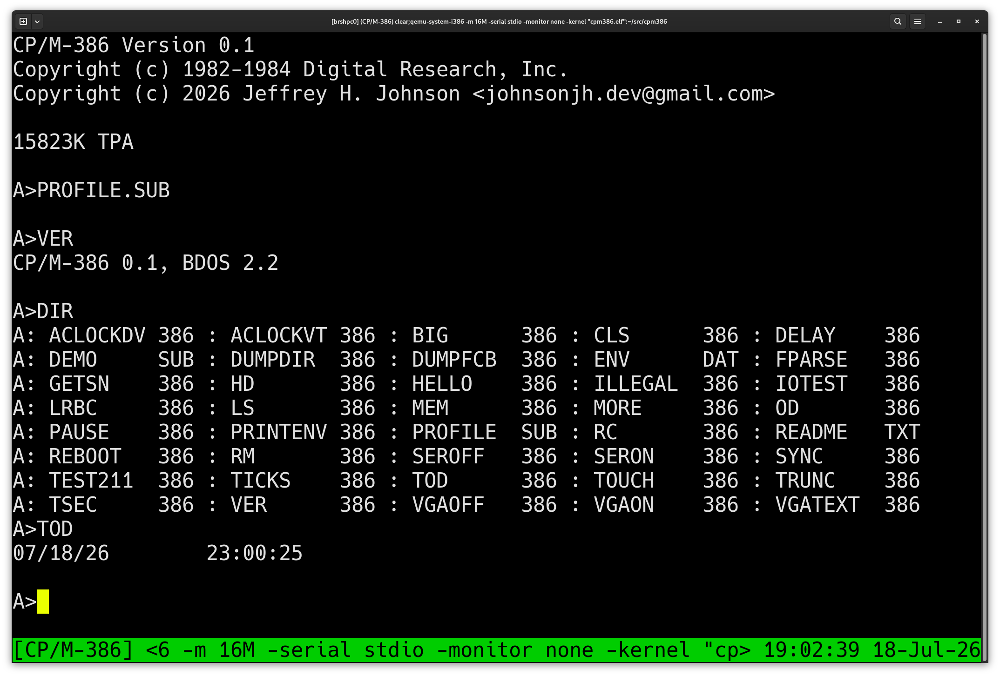

# CP/M-386

<!-- Copyright (c) 2026 Jeffrey H. Johnson -->
<!-- SPDX-License-Identifier: MIT -->
<!-- scspell-id: 696e52ee-8276-11f1-b02c-80ee73e9b8e7 -->

**CP/M-386** is CP/M for 386 protected mode, derived from CP/M-68K.

## Overview

**CP/M-386 is currently in the** ***very*** **early development stages.**

* Full 32-bit [protected mode](https://en.wikipedia.org/wiki/Protected_mode)
  implementation with
  [Ring-3 TPA](https://en.wikipedia.org/wiki/Protection_ring).
* Bootable via 3.5" 1.44MB floppy disk
  [MBR](https://en.wikipedia.org/wiki/Master_boot_record) or GRUB
  [Multiboot](https://en.wikipedia.org/wiki/Multiboot_specification) kernel.
* Supports [VGA text](https://en.wikipedia.org/wiki/VGA_text_mode) (`0xB8000`)
  and/or [COM1 serial](https://en.wikipedia.org/wiki/Serial_port)
  (9600/N/8/1, `0x3F8`) consoles.
* **No floppy/hard disk/CD/USB/network/sound/other drivers** (**yet**).

## Screenshots

<div style="display:flex; justify-content:center; align-items:center;">
 <a href=".img/VGA.png" style="flex:1; text-align:center;">
  
 </a>
 <a href=".img/SER.png" style="flex:1; text-align:center;">
  
 </a>
</div>

## Build requirements

* [AWK](https://en.wikipedia.org/wiki/AWK)
* [Cpmtools](https://www.moria.de/~michael/cpmtools/)
* [GNU Binutils](https://www.gnu.org/software/binutils/)
* [GNU Coreutils](https://www.gnu.org/software/coreutils/)
* [GNU GCC](https://gcc.gnu.org/) or [LLVM Clang](https://clang.llvm.org)
* [GNU Make](https://www.gnu.org/software/make/)
* [NASM](https://nasm.us/)

[QEMU](https://www.qemu.org) is recommended for testing.

## Compilation

Building **CP/M-386** is supported on **Haiku**, **Linux**, **NetBSD**,
and **OpenBSD**,

**GCC** build (default):

```sh
make -j "$(nproc 2> /dev/null || printf '%s' 1)"
make test
```

**Clang** build:

```sh
make -j "$(nproc 2> /dev/null || printf '%s' 1)" CC="clang"
make test
```

## QEMU Testing

[Multiboot](https://en.wikipedia.org/wiki/Multiboot_specification) kernel:

```sh
qemu-system-i386 -m 4G -serial stdio -monitor none -kernel "cpm386.elf"
```

Floppy ([MBR](https://en.wikipedia.org/wiki/Master_boot_record)) loader:

```sh
qemu-system-i386 -m 4G -serial stdio -monitor none -fda "floppy.img"
```

### QEMU notes

* Use `-display none` to disable VGA video (and use *only* serial console).
* Use `-serial none` to disable the serial UART (and use *only* VGA console).

## Code statistics

<!-- scc-start -->
<table id="scc-table">
        <thead><tr>
                <th>Language</th>
                <th>Files</th>
                <th>Lines</th>
                <th>Blank</th>
                <th>Comment</th>
                <th>Code</th>
                <th>Complexity</th>
                <th>Bytes</th>
                <th>Uloc</th>
        </tr></thead>
        <tbody><tr>
                <th>C</th>
                <th>46</th>
                <th>17884</th>
                <th>3112</th>
                <th>2590</th>
                <th>12182</th>
                <th>2636</th>
                <th>443760</th>
                <th>7050</th>
        </tr><tr>
                <th>C Header</th>
                <th>15</th>
                <th>1805</th>
                <th>291</th>
                <th>611</th>
                <th>903</th>
                <th>9</th>
                <th>71060</th>
                <th>1053</th>
        </tr><tr>
                <th>Makefile</th>
                <th>1</th>
                <th>732</th>
                <th>175</th>
                <th>112</th>
                <th>445</th>
                <th>46</th>
                <th>23722</th>
                <th>441</th>
        </tr><tr>
                <th>Assembly</th>
                <th>3</th>
                <th>574</th>
                <th>66</th>
                <th>91</th>
                <th>417</th>
                <th>0</th>
                <th>12945</th>
                <th>396</th>
        </tr><tr>
                <th>Markdown</th>
                <th>1</th>
                <th>188</th>
                <th>30</th>
                <th>0</th>
                <th>158</th>
                <th>0</th>
                <th>5498</th>
                <th>143</th>
        </tr></tbody>
        <tfoot><tr>
                <th>Total</th>
                <th>66</th>
                <th>21183</th>
                <th>3674</th>
                <th>3404</th>
                <th>14105</th>
                <th>2691</th>
                <th>556985</th>
                <th>9043</th>
        </tr></tfoot></table>
<!-- scc-end -->

## License

* **CP/M-386** is distributed under the terms of the permissive
  [MIT&nbsp;License](LICENSE).

* **CP/M-386** is a derivative of **CP/M-68K** and includes portions of
  [CP/M&nbsp;Plus (aka CP/M&nbsp;3)](https://en.wikipedia.org/wiki/CP/M#CP/M_Plus).

* Bryan W. Sparks of DRDOS,&nbsp;Inc. dba DeviceLogics&nbsp;LLC, successor
  in interest to Digital&nbsp;Research,&nbsp;Inc.’s CP/M assets, explicitly
  grants an unlimited authorization to use, distribute, modify, enhance, and
  otherwise make available CP/M technology, including the CP/M operating
  systems and their derivatives.

<!--
Local Variables:
mode: markdown
indent-tabs-mode: nil
fill-column: 80
eval: (setq-local display-fill-column-indicator-column 72)
eval: (display-fill-column-indicator-mode 1)
End:
-->
<!-- vim: set ft=markdown expandtab cc=80 : -->
<!-- EOF -->
