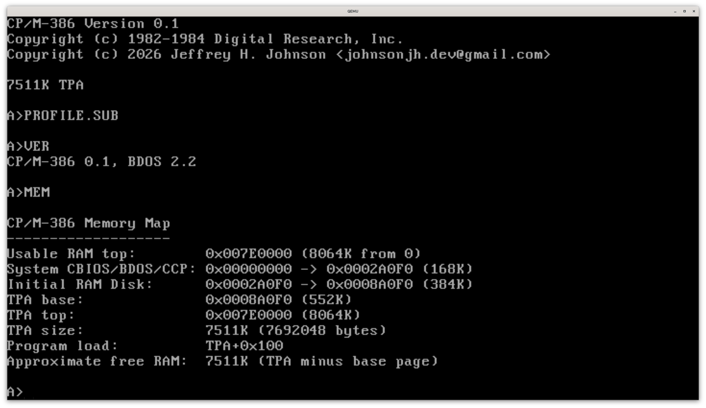
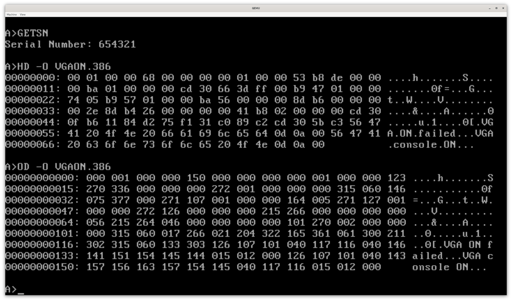
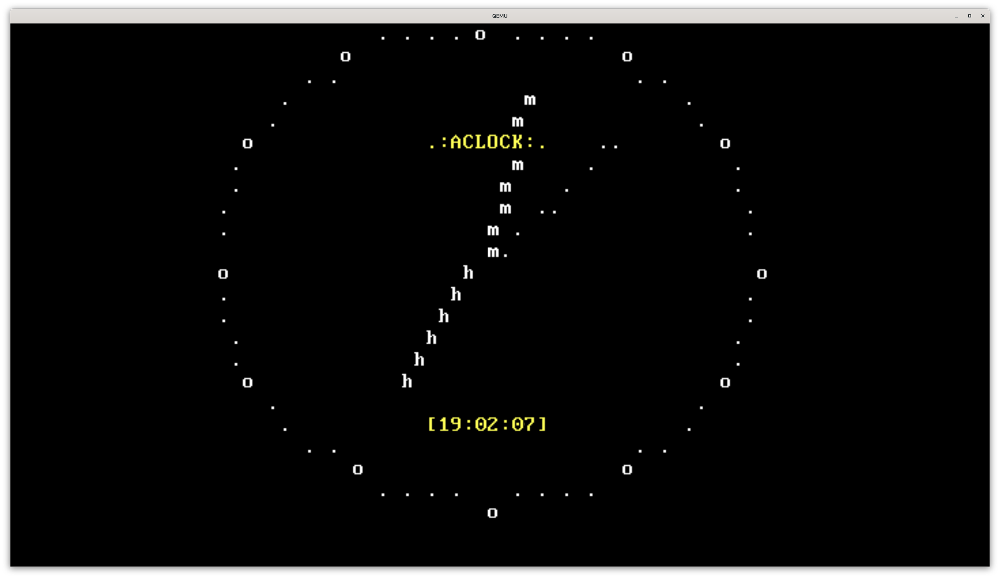
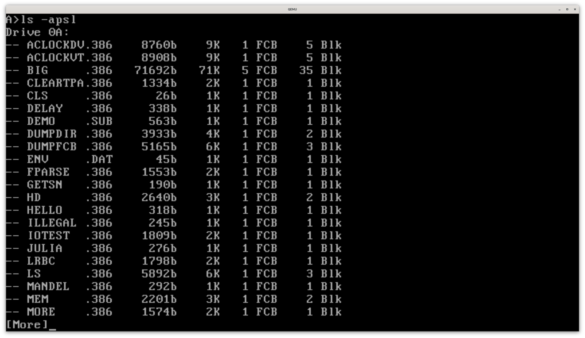

# CP/M-386

<!-- Copyright (c) 2026 Jeffrey H. Johnson -->
<!-- SPDX-License-Identifier: MIT -->
<!-- scspell-id: 696e52ee-8276-11f1-b02c-80ee73e9b8e7 -->

**CP/M‑386** is **CP/M** for 386 protected mode, derived from **CP/M‑68K**.

---

<!-- toc -->

- [Overview](#overview)
- [Hardware support](#hardware-support)
- [CP/M compatibility](#cpm-compatibility)
- [Screenshots](#screenshots)
- [Build requirements](#build-requirements)
- [Compilation](#compilation)
- [Build output](#build-output)
- [QEMU testing](#qemu-testing)
- [QEMU notes](#qemu-notes)
- [Included utilities](#included-utilities)
- [Contributing](#contributing)
- [Future plans](#future-plans)
- [Code statistics](#code-statistics)
- [Mirrors](#mirrors)
- [License](#license)

<!-- tocstop -->

---

## Overview

**CP/M‑386 is currently in the** ***very*** **early development stages.**

* Full 32‑bit [protected mode](https://en.wikipedia.org/wiki/Protected_mode)
  implementation with
  [Ring‑3 TPA](https://en.wikipedia.org/wiki/Protection_ring).
* Bootable via 3.5" 1.44MB floppy disk
  [MBR](https://en.wikipedia.org/wiki/Master_boot_record) or GRUB
  [Multiboot](https://en.wikipedia.org/wiki/Multiboot_specification) kernel.
* Supports [VGA text](https://en.wikipedia.org/wiki/VGA_text_mode) (`0xB8000`)
  and/or [COM1 serial](https://en.wikipedia.org/wiki/Serial_port)
  (9600/N/8/1, `0x3F8`) consoles.
* **No floppy/hard disk/CD/USB/network/sound/other drivers** (**yet**).

## Hardware support

* Compatible with 386 (and later systems) with 1MB (or more) memory.
* Systems using either PC BIOS or UEFI (with CSM) are supported.
* VGA, 8042 PS/2, 8250/16450/16550 UART, CMOS RTC, and 8253/8254 PIT
  are supported.

## CP/M compatibility

**CP/M‑386** should be highly source‑compatible with other implementations:

|                System | BDOS coverage       |
|----------------------:|:--------------------|
| **CP/M‑68K&nbsp;1.3** | **100%**            |
| **CP/M&nbsp;2.2**     | **98%**<sup>†</sup> |
| **CP/M‑Plus**         | **71%**             |
| **DOS‑Plus**          | **62%**             |
| **MP/M&nbsp;2.1**     | **50%**             |

The system currently reports **BDOS 2.2** to applications.

* The **CP/M‑386** BDOS is at full parity with **CP/M‑68K&nbsp;1.3**.
* <sup>†</sup>**CP/M&nbsp;2.2** equivalence is lacking only
  [BDOS 27](https://www.seasip.info/Cpm/bdos.html#27) (which was deliberately
  omitted from **CP/M‑68K** by Digital Research).
* A large majority of the **CP/M‑Plus** (**CP/M&nbsp;3**) BDOS is also
  supported.
* More than 60% of the **DOS‑Plus** additions have been implemented.
* Approximately half of the **MP/M** extensions have been completed.
  * The missing functionality is largely the multi‑user, multi‑tasking,
    message queuing, and process control calls that don't apply to a
    single‑user **CP/M** implementation.
* Unique **CP/M‑386**‑specific BDOS extensions have been added to accommodate
  new features like direct video access and high‑resolution timing.

## Screenshots

<table style="width:100%; border-collapse:collapse;">
 <tr>
  <td style="width:50%; padding:10px; text-align:center;">
   <a href=".img/4.png">
    
   </a>
  </td>
  <td style="width:50%; padding:10px; text-align:center;">
   <a href=".img/2.png">
    
   </a>
  </td>
 </tr>
 <tr>
  <td style="width:50%; padding:10px; text-align:center;">
   <a href=".img/3.png">
    
   </a>
  </td>
  <td style="width:50%; padding:10px; text-align:center;">
   <a href=".img/1.png">
    
   </a>
  </td>
 </tr>
</table>


## Build requirements

The following dependencies are required to compile **CP/M‑386**:

* [AWK](https://en.wikipedia.org/wiki/AWK)
* [Cpmtools](https://www.moria.de/~michael/cpmtools/files) (2.23+ recommended)
* [GNU Binutils](https://www.gnu.org/software/binutils/)
* [GNU Coreutils](https://www.gnu.org/software/coreutils/)
* [GNU GCC](https://gcc.gnu.org/) or [LLVM Clang](https://clang.llvm.org)
* [GNU Make](https://www.gnu.org/software/make/)
* [NASM](https://nasm.us/)

[QEMU](https://www.qemu.org) is recommended for testing.

## Compilation

Building **CP/M‑386** is supported on current releases of **NetBSD**,
**FreeBSD**, **Haiku**, and recent **Linux** distributions.

The following are the minimum versions of Linux distributions that have been
verified to build **CP/M‑386** successfully: CentOS Stream 9, Fedora 36,
Debian 12, Ubuntu 18.04 (with `gcc-16` from `ppa:ubuntu-toolchain-r/test`),
Ubuntu 22.04, Alpine 3.24, and OpenSUSE Leap 15.4.
[]()

[]()
* **GCC** build (recommended):

  ```sh
  make -Orecurse -j "$(nproc 2> /dev/null || printf '%s' 1)"
  make test
  ```
[]()

[]()
* **Clang** build:

  ```sh
  make -Orecurse -j "$(nproc 2> /dev/null || printf '%s' 1)" CC="clang"
  make test CC="clang"
  ```
[]()

[]()
* It is recommended to use **GCC** as **Clang**‑compiled i386 code is larger.
* Be sure to `make clean` if switching compilers or adjusting compiler flags.
* 32‑bit support libraries are required to run the test suite (`make test`).

## Build output

* The build produces two primary artifacts:

  |         File | Description                            |
  |-------------:|:---------------------------------------|
  | `cpm386.elf` | Multiboot kernel image                 |
  | `floppy.img` | Bootable 3.5" 1.44MB floppy disk image |

## QEMU testing

* [Multiboot](https://en.wikipedia.org/wiki/Multiboot_specification)
  kernel (recommended):

  ```sh
  qemu-system-i386 -m 2M -serial stdio -monitor none -kernel "cpm386.elf"
  ```

* Floppy [MBR](https://en.wikipedia.org/wiki/Master_boot_record) loader:

  ```sh
  qemu-system-i386 -m 2M -serial stdio -monitor none -drive if=floppy,format=raw,file="floppy.img"
  ```

## QEMU notes

* Use `-nographic -display none` to disable VGA video (and use *only* serial console).
* Use `-serial none` to disable the serial UART (and use *only* VGA console).

## Included utilities

|        Program | Description                                                                                        |
|---------------:|:---------------------------------------------------------------------------------------------------|
| `ACLOCKDV.386` | [aclock](https://github.com/tenox7/aclock) (VGA console version)                                   |
| `ACLOCKVT.386` | [aclock](https://github.com/tenox7/aclock) (ANSI terminal version)                                 |
| `BIG.386`      | Multi‑extent loading test executable                                                               |
| `CLEARTPA.386` | Clears (zeros) and optionally verifies the TPA                                                     |
| `CLS.386`      | Clear screen (BDOS 221)                                                                            |
| `DELAY.386`    | Delay test ([BDOS 141](https://www.seasip.info/Cpm/bdos.html#141))                                 |
| `DEMO.SUB`     | SUBMIT demonstration                                                                               |
| `DUMPDIR.386`  | Directory entry dump utility ([BDOS 17](https://www.seasip.info/Cpm/bdos.html#17), [BDOS 18](https://www.seasip.info/Cpm/bdos.html#18)) |
| `DUMPFCB.386`  | File control block dump utility ([BDOS 15](https://www.seasip.info/Cpm/bdos.html#15))              |
| `ENV.DAT`      | Environment data file                                                                              |
| `FPARSE.386`   | F_PARSE test ([BDOS 152](https://www.seasip.info/Cpm/bdos.html#152))                               |
| `GETSN.386`    | Display serial number ([BDOS 107](https://www.seasip.info/Cpm/bdos.html#107))                      |
| `HD.386`       | Hex dump utility                                                                                   |
| `HELLO.386`    | Hello world (the very first **CP/M‑386** program!)                                                 |
| `ILLEGAL.386`  | Ring‑3 protection and exception handler test                                                       |
| `IOTEST.386`   | File I/O BDOS tests                                                                                |
| `JULIA.386`    | Draw a Julia set fractal (terminal version)                                                        |
| `LRBC.386`     | Query Last Record Byte Count                                                                       |
| `LS.386`       | List files (with sizes)                                                                            |
| `MANDEL.386`   | Draw a Mandelbrot set fractal (terminal version)                                                   |
| `MEM.386`      | Memory map utility (BDOS 227)                                                                      |
| `MORE.386`     | UNIX `more`‑style pager                                                                            |
| `OD.386`       | Octal dump utility                                                                                 |
| `PAUSE.386`    | Wait for keypress                                                                                  |
| `PRINTENV.386` | Print environment and system data                                                                  |
| `PROFILE.SUB`  | SUBMIT script (automatically executed at boot)                                                     |
| `RC.386`       | Return code test and query ([BDOS 108](https://www.seasip.info/Cpm/bdos.html#108))                 |
| `README.TXT`   | Sample text file                                                                                   |
| `REBOOT.386`   | Reboot utility (BDOS 220)                                                                          |
| `RM.386`       | UNIX `rm`‑like interactive file deletion utility                                                   |
| `SEROFF.386`   | Disable serial console (BDOS 223)                                                                  |
| `SERON.386`    | Enable serial console (BDOS 223)                                                                   |
| `STAT.386`     | STAT (A port of Zilog **CP/M‑Z8000** STAT v1.0C 01/03/84)                                          |
| `SYNC.386`     | Synchronize disks ([BDOS 48](https://www.seasip.info/Cpm/bdos.html#48))                            |
| `TEST211.386`  | Numeric format test ([BDOS 211](https://www.seasip.info/Cpm/bdos.html#211))                        |
| `TICKS.386`    | High‑resolution timer tests (BDOS 225, BDOS 226)                                                   |
| `TOD.386`      | Get (and set) Time of Day clock ([BDOS 104](https://www.seasip.info/Cpm/bdos.html#104), [BDOS 105](https://www.seasip.info/Cpm/bdos.html#105)) |
| `TOUCH.386`    | Create an empty file                                                                               |
| `TRUNCATE.386` | File truncation utility                                                                            |
| `TRUNCTST.386` | Truncation tests ([BDOS 99](https://www.seasip.info/Cpm/bdos.html#99))                             |
| `TSEC.386`     | Get date and time ([BDOS 155](https://www.seasip.info/Cpm/bdos.html#155))                          |
| `VER.386`      | Display OS version ([BDOS 163](https://www.seasip.info/Cpm/bdos.html#163))                         |
| `VGAOFF.386`   | Disable VGA console (BDOS 222)                                                                     |
| `VGAON.386`    | Enable VGA console (BDOS 222)                                                                      |
| `VGATEXT.386`  | VGA direct access demo (BDOS 224)                                                                  |

## Contributing

* Do **not** open pull requests with large amounts of LLM‑generated code.
  These will almost certainly be immediately rejected.

* There is currently **no** AI‑generated code in the repository, as this
  project is intended to be as much of a learning experience for me as
  it is a useful OS port.

* Usage of AI (artificial intelligence) tools by contributors is currently
  permitted, subject to the same terms and conditions as the
  [LLVM AI Tool Use Policy](https://llvm.org/docs/AIToolPolicy.html), but
  this permission may be withdrawn at any time and without notice.

## Future plans

See [FUTURE.md](FUTURE.md).

## Code statistics

<!-- scc-start -->
<table id="scc-table">
        <thead><tr>
                <th>Language</th>
                <th>Files</th>
                <th>Lines</th>
                <th>Blank</th>
                <th>Comment</th>
                <th>Code</th>
                <th>Complexity</th>
                <th>Bytes</th>
                <th>Uloc</th>
        </tr></thead>
        <tbody><tr>
                <th>C</th>
                <th>55</th>
                <th>24461</th>
                <th>4605</th>
                <th>3509</th>
                <th>16347</th>
                <th>3660</th>
                <th>584186</th>
                <th>8582</th>
        </tr><tr>
                <th>C Header</th>
                <th>15</th>
                <th>1953</th>
                <th>320</th>
                <th>718</th>
                <th>915</th>
                <th>13</th>
                <th>75048</th>
                <th>1076</th>
        </tr><tr>
                <th>Makefile</th>
                <th>2</th>
                <th>1395</th>
                <th>263</th>
                <th>182</th>
                <th>950</th>
                <th>298</th>
                <th>46527</th>
                <th>707</th>
        </tr><tr>
                <th>Assembly</th>
                <th>3</th>
                <th>605</th>
                <th>75</th>
                <th>108</th>
                <th>422</th>
                <th>0</th>
                <th>13909</th>
                <th>409</th>
        </tr><tr>
                <th>Markdown</th>
                <th>2</th>
                <th>485</th>
                <th>64</th>
                <th>0</th>
                <th>421</th>
                <th>0</th>
                <th>21418</th>
                <th>374</th>
        </tr><tr>
                <th>Linker&nbsp;Script</th>
                <th>2</th>
                <th>159</th>
                <th>31</th>
                <th>0</th>
                <th>128</th>
                <th>0</th>
                <th>3855</th>
                <th>79</th>
        </tr></tbody>
        <tfoot><tr>
                <th>Total</th>
                <th>79</th>
                <th>29058</th>
                <th>5358</th>
                <th>4517</th>
                <th>19183</th>
                <th>3971</th>
                <th>744943</th>
                <th>11167</th>
        </tr></tfoot></table>
<!-- scc-end -->

## Mirrors

* The canonical home of this software is
  [`https://gitlab.com/johnsonjh/cpm386`](https://gitlab.com/johnsonjh/cpm386),
  with a mirror on [GitHub](https://github.com/johnsonjh/cpm386).

## License

* **CP/M‑386** is distributed under the terms of the permissive
  [MIT&nbsp;License](LICENSE).
* Bryan W. Sparks of DRDOS,&nbsp;Inc. dba DeviceLogics&nbsp;LLC, successor
  in interest to Digital&nbsp;Research,&nbsp;Inc.’s CP/M assets, explicitly
  grants an unlimited authorization to use, distribute, modify, enhance, and
  otherwise make available CP/M technology, including the CP/M operating
  systems and their derivatives.

<!--
Local Variables:
mode: markdown
indent-tabs-mode: nil
fill-column: 80
eval: (setq-local display-fill-column-indicator-column 72)
eval: (display-fill-column-indicator-mode 1)
End:
-->
<!-- vim: set ft=markdown expandtab cc=80 : -->
<!-- EOF -->
